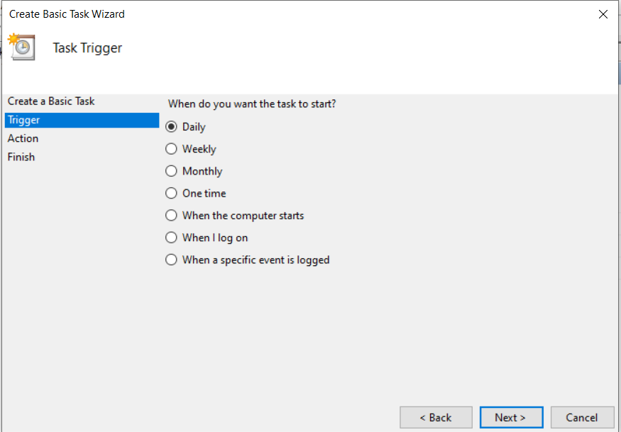

#### **How to use python to automatically fetch new wallpapers from unsplash.com and set them as desktop wallpaper**

Have you ever wanted to build your own version of Bing's daily wallpaper? Well, using python, you can automate just about any task, including fetching new wallpapers and setting them as your desktop's background. In this tutorial, we will use Unsplash public API to fetch beautiful wallpapers, save them to your file system and set them as your desktop background. 

So, let's get started now.

**Requirements:**

- Python - 3.8
- Pip - 19.0
- requests 
- Pillow

> NOTE:  Pillow and PIL cannot survive together. You must uninstall one of them and only install one.


**Let's install our requirements first -** 

Get the latest version of Python [here.](https://www.python.org/downloads/)

Pip comes packaged with the python distribution.

```
python3 -m pip install requests
```

```python
python3 -m pip install --upgrade pip
python3 -m pip install --upgrade Pillow
```


#### UNSPLASH API

**BASE API URL -**	https://api.unsplash.com/

**API Endpoint -**	

```
GET /photos/random
```

**Parameters**-

- ```
  query = wallpaper
  ```

- ```
  orientation = landscape
  ```

  

We will use the unsplash API to fetch wallpaper images. 

- Go to [this](https://unsplash.com/join) link and register as a developer.

- Create a new application.


- Copy the access & secret keys and keep them ready. 


Now, we are ready to request images from Unsplash.    

Let's run the code below, and inspect the response from unsplash.

```python
import ctypes

from PIL import Image
from io import BytesIO

import requests

r = requests.get('https://api.unsplash.com/photos/random/?client_id=<YOUR_CLIENT_ID>&query=wallpaper&orientatio n=landscape')
r = r.json()
print(r)
```

Copy and paste the access key you obtained earlier in place of <YOUR_CLIENT_ID>. 

Here, we send a GET request to `/photos/random` endpoint, and the response is stored in r. Then, we parse the response into a JSON object using the method `.json()`.  Next we print out our response to inspect its structure. We see the following result:

```json
{'id': 'qQUtvVdurHg', 'created_at': '2016-08-02T15:18:37-04:00', 'updated_at': '2020-05-28T01:17:23-04:00', 'promoted_at': '2016-08-02T15:18:37-04:00', 'width': 4534, 'height': 3018, 'color': '#31221F', 'description': None, 'alt_description': 'fox laying on snow', 'urls': {'raw': 'https://images.unsplash.com/photo-1470165511815-34e78ff7a111?ixlib=rb-1.2.1&ixid=eyJhcHBfaWQiOjEzMjM3MX0', 'full': 'https://images.unsplash.com/photo-1470165511815-34e78ff7a111?ixlib=rb-1.2.1&q=85&fm=jpg&crop=entropy&cs=srgb&ixid=eyJhcHBfaWQiOjEzMjM3MX0', 'regular': 'https://images.unsplash.com/photo-1470165511815-34e78ff7a111?ixlib=rb-1.2.1&q=80&fm=jpg&crop=entropy&cs=tinysrgb&w=1080&fit=max&ixid=eyJhcHBfaWQiOjEzMjM3MX0', 'small': 'https://images.unsplash.com/photo-1470165511815-34e78ff7a111?ixlib=rb-1.2.1&q=80&fm=jpg&crop=entropy&cs=tinysrgb&w=400&fit=max&ixid=eyJhcHBfaWQiOjEzMjM3MX0', 'thumb': 'https://images.unsplash.com/photo-1470165511815-34e78ff7a111?ixlib=rb-1.2.1&q=80&fm=jpg&crop=entropy&cs=tinysrgb&w=200&fit=max&ixid=eyJhcHBfaWQiOjEzMjM3MX0'}, 'links': {'self': 'https://api.unsplash.com/photos/qQUtvVdurHg', 'html': 'https://unsplash.com/photos/qQUtvVdurHg', 'download': 'https://unsplash.com/photos/qQUtvVdurHg/download', 'download_location': 'https://api.unsplash.com/photos/qQUtvVdurHg/download'}, 'categories': [], 'likes': 3392, 'liked_by_user': False, 'current_user_collections': [], 'sponsorship': None, 'user': {'id': 'Cd-djTuTKd4', 'updated_at': '2020-05-28T08:03:16-04:00', 'username': 'rayhennessy', 'name': 'Ray Hennessy', 'first_name': 'Ray', 'last_name': 'Hennessy', 'twitter_username': 'ray_hennessy', 'portfolio_url': 'http://www.rayhennessy.com', 'bio': 'A passionate wildlife photographer focusing on birds.', 'location': 'Clementon, NJ', 'links': {'self': 'https://api.unsplash.com/users/rayhennessy', 'html': 'https://unsplash.com/@rayhennessy', 'photos': 'https://api.unsplash.com/users/rayhennessy/photos', 'likes': 'https://api.unsplash.com/users/rayhennessy/likes', 'portfolio': 'https://api.unsplash.com/users/rayhennessy/portfolio', 'following': 'https://api.unsplash.com/users/rayhennessy/following', 'followers': 'https://api.unsplash.com/users/rayhennessy/followers'}, 'profile_image': {'small': 'https://images.unsplash.com/profile-1470165649183-667f4d7f5839?ixlib=rb-1.2.1&q=80&fm=jpg&crop=faces&cs=tinysrgb&fit=crop&h=32&w=32', 'medium': 'https://images.unsplash.com/profile-1470165649183-667f4d7f5839?ixlib=rb-1.2.1&q=80&fm=jpg&crop=faces&cs=tinysrgb&fit=crop&h=64&w=64', 'large': 'https://images.unsplash.com/profile-1470165649183-667f4d7f5839?ixlib=rb-1.2.1&q=80&fm=jpg&crop=faces&cs=tinysrgb&fit=crop&h=128&w=128'}, 'instagram_username': 'ray_hennessy_wildlife', 'total_collections': 3, 'total_likes': 4, 'total_photos': 82, 'accepted_tos': True}, 'exif': {'make': 'NIKON CORPORATION', 'model': 'NIKON D4S', 'exposure_time': '1/320', 'aperture': '4.0', 'focal_length': '500.0', 'iso': 4000}, 'location': {'title': 'Lanoka Harbor, Berkeley Township, New Jersey, United States', 'name': 'Lanoka Harbor, Berkeley Township, New Jersey, United States', 'city': 'Berkeley Township', 'country': 'United States', 'position': {'latitude': 39.85611167, 'longitude': -74.08521667}}, 'views': 11801936, 'downloads': 103577}
```

If you notice closely, we found a `links` property which contains a child node **'download'**. These field contains the link for downloading the image and that is exactly what we needed. 

So, let's get the image from the link-

```python
img_link = r["links"]["download"]
r2 = requests.get(img_link)
```

 Now, what we have is binary data and is stored in r2.content property. We will use `BytesIO()` method from the **io** module to read our binary data, and open the image using `Image.open()` from **PIL** library.

Finally, save the image wherever you want to store the wallpapers. 

```python
i = Image.open(BytesIO(r2.content))
save_path = r"C:\Users\ipras\Pictures\Saved Pictures\image" + r["id"] + ".jpg"
i.save(save_path)
```

We are already halfway there.  Now, we just need to set the downloaded image as our desktop wallpaper.

For that, we have to somehow access *user32.dll* file, which is a standard DLL that comes with windows and contains API that help an app create and implement standard windows GUI.

> NOTE: DLL stands for Dynamic link library. As it says on Windows Dev Docs, ***A dynamic-link library (DLL) is a module that contains functions and data that can be used by another module (application or DLL). The Windows application programming interface (API) is implemented as a set of DLLs, so any process that uses the Windows API uses dynamic linking.*** 

*user32.dll* contains the method `SystemParametersInfoW`, which lets you access and set system wide parameters such as SPI_SETDESKTOPWALLPAPERS.


Luckily, in Python, there's a `ctypes` library which is a foreign function library for python, provides C compatible data types and allows you to access functions present in shared libraries or DLL's .

Write the following code in the same file.

```python
SPI_SETDESKWALLPAPER = 20 ctypes.windll.user32.SystemParametersInfoW(SPI_SETDESKWALLPAPER, 0, save_path , 0)
```

Run the script and you should see the desktop wallpaper change.

And it's done. Bingo. We have our python script which fetches beautiful wallpapers from unsplash and set them as our desktop background. 

Here's the full code : 

```python
import ctypes

from PIL import Image
from io import BytesIO

import requests

r = requests.get('https://api.unsplash.com/photos/random/?client_id=<YOUR_CLIENT_ID>&query=wallpaper&orientatio n=landscape')
r = r.json()

img_link = r["links"]["download"]
r2 = requests.get(img_link)
print(r2)
i = Image.open(BytesIO(r2.content))
save_path = r"C:\Users\ipras\Pictures\Saved Pictures\image" + r["id"] + ".jpg"
i.save(save_path)

pathToImage = save_path
SPI_SETDESKWALLPAPER = 20

ctypes.windll.user32.SystemParametersInfoW(SPI_SETDESKWALLPAPER, 0, pathToImage, 0)

```

The only thing left is to schedule the python script to run automatically on daily basis. That can be easily accomplished with the help of **Task Scheduler** app on windows. 

- Open task scheduler

- Click on **Create Basic Task...**

  

- Enter Name and description for the task.

  

- Select trigger - 

  

- Now, select **Start a program** as action.

  

- Now, select your script as the action script.

  

- Finally, review your task details in the Finish tab and click *Finish*. 

It's done. Now your python wallpaper changer script will run daily at the specified time and as a result will update your desktop wallpaper.


**If you found the article helpful, please like and share it. Follow me on [Medium](https://medium.com/@iprashant2402) to regularly get updates when I publish a new article. You can also connect with me on [LinkedIn](https://www.linkedin.com/in/prashant-singh-a51574123) and checkout my [Github](https://www.github.com/iprashant2402).* 

*Also, I would appreciate any feedback from you guys.*
  